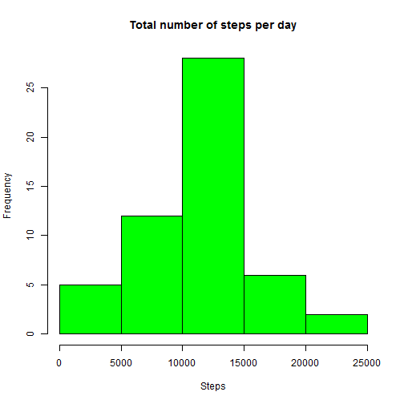
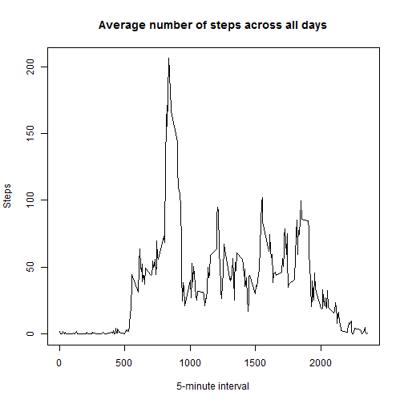
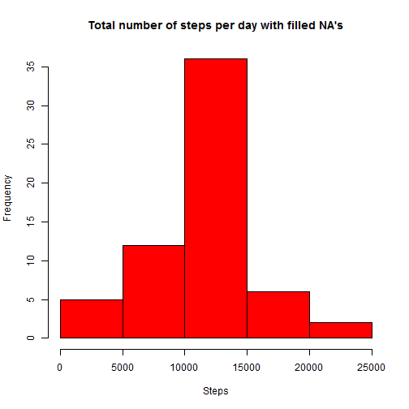

# Reproducible Research: Peer Assessment 1
## Loading and preprocessing the data


```r
## Assume the activity.zip was placed at the same directory as this Rmarkdown file 
unzip("activity.zip")
dataraw <- read.csv("activity.csv")
dataraw$date = as.Date(dataraw$date, "%Y-%m-%d")
```

## What is mean total number of steps taken per day?


```r
## Make a histogram of the total number of steps taken each day
dataTidy <- dataraw[complete.cases(dataraw$steps), ]
stepSum <- aggregate(steps ~ date, data = dataTidy, FUN = sum)
hist(stepSum$steps, 
     col = "green", 
     xlab = "Steps", 
     main = "Total number of steps per day")
```

 

```r
## Calculate and report the mean and median total number of steps taken per day
stepMean <- mean(stepSum$steps)
stepMedian <- median(stepSum$steps)
```
- The **mean** total numbers of steps per day is: **10766.19**  
- The **median** total numbers of steps per day is: **10765**

## What is the average daily activity pattern?


```r
## Make a plot
stepAvg <- aggregate(steps ~ interval, dataTidy, mean)
with(stepAvg, plot(steps ~ interval, 
                   type = "l", 
                   xlab = "5-minute interval", 
                   ylab = "Steps", 
                   main = "Average number of steps across all days"))
```

 

```r
## Find 5-minute interval, which contains the maximum number of steps
maxId <- which.max(stepAvg$steps)
stepAvgMax <- stepAvg[maxId, "interval"]
```
- On average across all the days in the dataset, **835** interval contains maximum number of steps 


## Imputing missing values


```r
## Calculate the total number of missing values in the dataset
totalNA <- sum(!complete.cases(dataraw))
```
- Total number of missing values in the dataset is: **2304**

```r
## Strategy: use mean of the 5-minute interval
naIndex <- which(is.na(dataraw$steps))
naInterval <- dataraw[naIndex, 3]
fillSteps <- sapply(naInterval, function(x) { stepAvg[(stepAvg$interval==x), 2]})
```

```r
## Create a new dataset that is equal to the original dataset but with the missing data filled in
dataFilled <- dataraw 
dataFilled[naIndex, 1] <- fillSteps
```

```r
## Again make a histogram of the total number of steps taken each day
stepSumFilled <- aggregate(steps ~ date, data = dataFilled, FUN = "sum")
hist(stepSumFilled$steps, 
     col = "red", 
     xlab = "Steps", 
     main = "Total number of steps per day with filled NA's")
```

 

```r
## Calculate the mean and median total number of steps taken per day
stepMeanFilled <- mean(stepSumFilled$steps)
stepMedianFilled <- median(stepSumFilled$steps)
```
- The **mean** total numbers of steps per day is: **10766.19**  
- The **median** total numbers of steps per day is: **10766.19**

After imputing the missing step values, the mean total number of steps per day is unchanged while the median total number of steps per day changed from **10765** to **10766.19**. The impact of the imputation was a little increase in the median total number of steps per day.

## Are there differences in activity patterns between weekdays and weekends?


```r
## Set location to English
Sys.setlocale("LC_TIME", "English")
```

```
## [1] "English_United States.1252"
```

```r
## Create a new factor variable in the dataset
dataFilled$date <- as.Date(dataFilled$date)
dataFilled['weekIs'] <- factor(sapply(dataFilled$date, function(x){ 
    if (weekdays(x) == "Sunday" | weekdays(x) == "Saturday") { 
        "weekend" } 
    else { "weekday"} }))
```

```r
## Make a panel plot
stepAvgWeekIs <- aggregate(steps~interval + weekIs,data=dataFilled, FUN = mean)
library(lattice)
xyplot( steps ~ interval | weekIs, data = stepAvgWeekIs, 
        type="l", 
        layout=c(1,2), 
        xlab="Interval", ylab="Number of steps")
```

 

